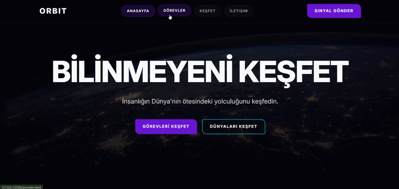

# ORBIT — Explore the Unknown

A modern, responsive space exploration website built with **HTML5, SCSS, and CSS3**. ORBIT is a fictional space platform that presents space missions, planets, and the future of human exploration through a futuristic dark-themed interface.

## Features

- **Homepage:** Hero section, mission statistics, featured missions, planet cards, and call-to-action sections.
- **Missions Page:** Mission cards with status labels, descriptions, and planned mission years.
- **Explore Page:** Solar System overview featuring all eight planets and their key information.
- **Contact Navigation:** Navigation links to the contact page.
- **Responsive Design:** Layouts built with CSS Grid, Flexbox, and media queries.
- **SCSS Architecture:** Organized stylesheets using variables, mixins, partials, and reusable components.
- **Reusable Card Components:** Consistent styling for missions and planets.
- **Dynamic SCSS Styling:** Planet-specific accent colors generated with SCSS maps and `@each`.
- **Modern UI:** Dark theme, gradients, glassmorphism-inspired navigation, hover effects, and rounded cards.
- **Custom Typography:** Inter font from Google Fonts.
  
  ---

## Technologies Used

- HTML5
- CSS3
- SCSS / Sass
- CSS Grid
- Flexbox
- Media Queries
- SCSS Variables and Mixins
- SCSS Maps and `@each`
- SCSS Placeholder Selectors and `@extend`
- Google Fonts
- Unsplash, NASA, Wikimedia Commons, and other external image sources

---

## Design System

---

### Color Palette

| Color | Hex | Usage |
|---|---|---|
| Background | `#030308` | Main page background |
| Surface | `#0B0B18` | Cards and content surfaces |
| Light Surface | `#16162A` | Hover states and elevated surfaces |
| Primary Purple | `#6D28D9` | Primary buttons and highlights |
| Secondary Blue | `#0EA5E9` | Secondary buttons and accents |
| Text | `#F8FAFC` | Main text |
| Muted | `#94A3B8` | Secondary text |

---

### Typography

**Inter** is used as the primary font family, providing a clean and modern interface.

---

## ORBIT – Image Credits & Sources

This document lists all externally sourced, high-resolution images used throughout the ORBIT project, along with their intended locations. These resources can be used as references during development or for educational purposes.

### 1. Homepage (`index.html`)

- **Hero Section (Earth from Space)**  
  https://images.unsplash.com/photo-1451187580459-43490279c0fa?q=80&w=2072&auto=format&fit=crop

- **About Section (Astronaut and Spacecraft)**  
  https://images.unsplash.com/photo-1446776811953-b23d57bd21aa?q=80&w=2072&auto=format&fit=crop

### 2. Missions (`index.html` and `missions.html`)

- **ORBITAL-X (Mars Surface)**  
  https://images.unsplash.com/photo-1614728894747-a83421e2b9c9?q=80&w=1000&auto=format&fit=crop

- **LUNA-07 (Lunar Surface)**  
  https://images.unsplash.com/photo-1522030299830-16b8d3d049fe?q=80&w=1000&auto=format&fit=crop

- **TITAN-01 (Saturn's Rings)**  
  https://static.scientificamerican.com/sciam/cache/file/8B1E8B0D-AF96-4ED6-890F407EAD5E2747_source.jpg

- **MARS-X (Next-Generation Spacecraft)**  
  https://images.unsplash.com/photo-1630839437035-dac17da580d0?q=80&w=1000&auto=format&fit=crop

- **EUROPA-04 (Icy Moon)**  
  https://encrypted-tbn0.gstatic.com/images?q=tbn:ANd9GcRtRDaDj66sScn08gloFfwDQk2JeG3xocggFyF1NN89tQ&s=10

- **SOLARIS (Solar Storm – NASA/Wikimedia)**  
  https://science.nasa.gov/wp-content/uploads/2025/08/gsfc-20171208-archive-e001435large.jpg

### 3. Planet Images

The following images are used in the planet exploration section. The Mars image is also reused for Mercury, Venus, and Earth with visual filters applied.

- **Mars (also reused for Mercury, Venus, and Earth with CSS filters)**  
  https://images.unsplash.com/photo-1710676145420-5f54d4add1e0?q=80&w=764&auto=format&fit=crop&ixlib=rb-4.1.0&ixid=M3wxMjA3fDB8MHxwaG90by1wYWdlfHx8fGVufDB8fHx8fA%3D%3D

- **Jupiter (NASA/Wikimedia)**  
  https://images.unsplash.com/photo-1706562018300-93e3df266600?q=80&w=1760&auto=format&fit=crop&ixlib=rb-4.1.0&ixid=M3wxMjA3fDB8MHxwaG90by1wYWdlfHx8fGVufDB8fHx8fA%3D%3D

- **Saturn**  
  http://images.unsplash.com/photo-1614732414444-096e5f1122d5?q=80&w=1548&auto=format&fit=crop&ixlib=rb-4.1.0&ixid=M3wxMjA3fDB8MHxwaG90by1wYWdlfHx8fGVufDB8fHx8fA%3D%3D

- **Neptune (NASA/Wikimedia)**  
  https://images.unsplash.com/photo-1614313913007-2b4ae8ce32d6?q=80&w=1548&auto=format&fit=crop&ixlib=rb-4.1.0&ixid=M3wxMjA3fDB8MHxwaG90by1wYWdlfHx8fGVufDB8fHx8fA%3D%3D

- **Uranus (color adjusted to green and blue tones using CSS)**  
  http://images.unsplash.com/photo-1614728423169-3f65fd722b7e?q=80&w=1548&auto=format&fit=crop&ixlib=rb-4.1.0&ixid=M3wxMjA3fDB8MHxwaG90by1wYWdlfHx8fGVufDB8fHx8fA%3D%3D

- **Mercury (color adjusted to green and blue tones using CSS)**  
  https://sarkac.org/wp-content/uploads/2024/01/Merkur-NASA.webp

- **Venus**  
  https://encrypted-tbn0.gstatic.com/images?q=tbn:ANd9GcTiehDWPkk8VoAkVLDWn_Ud-wpSV-6tAUYHxXEeEsXf7Q&s=10

- **Earth**  
  https://upload.wikimedia.org/wikipedia/commons/thumb/2/2d/Meteosat-12-fci-march-equinox-2025-noon.jpg/1280px-Meteosat-12-fci-march-equinox-2025-noon.jpg?utm_source=crh.wikipedia.org&utm_campaign=index&utm_content=thumbnail

 ---

## 🔍 Preview

---

## 📞 Contact  

📩 **Email:** [saadetnajaf@gmail.com](mailto:saadetnajaf@gmail.com)  
📷 **Instagram:** [@saadet_najaf](https://www.instagram.com/saadet_najaf)  
💼 **LinkedIn:** [Saadet Najaf](https://www.linkedin.com/in/saadetnajaf/)
